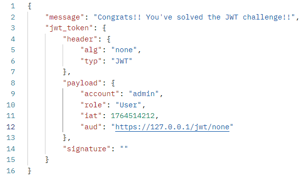
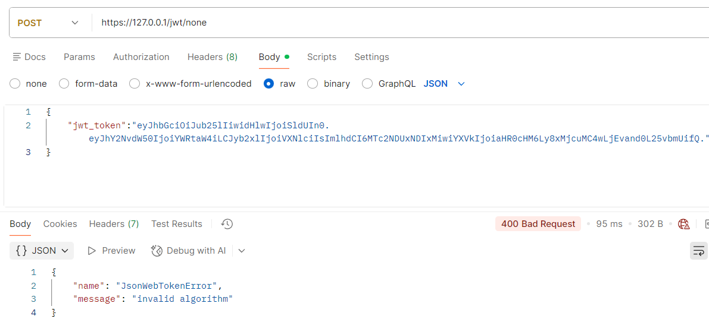

# zad 1
wybrałem aplikację Pythonową, obiekt Customer.  
Testy znajdują się w katalogu Python/Flask_Book_Library/tests  
testy wykonałem korzystając z biblioteki pytest
dodałem do dockerfile komendę: `RUN pytest -vv`  

# zad 2

### 1. znalazłem token który otrzymuje użytkownik Bob:
od komendy `POST https://127.0.0.1/jwt`

### 2. aby dostać się na admina musiałem:
- zmienić pole alg na "none"
- zmienić pole account na "admin"
- usunąć klucz publiczny
finalny token:
`eyJhbGciOiJub25lIiwidHlwIjoiSldUIn0.eyJhY2NvdW50IjoiYWRtaW4iLCJyb2xlIjoiVXNlciIsImlhdCI6MTc2NDUxNDIxMiwiYXVkIjoiaHR0cHM6Ly8xMjcuMC4wLjEvand0L25vbmUifQ.`

### 3. modyfikacja polegała na:
usunięciu przyjmowania algorytmu none
w linii 32:
algorithms: ['HS256']

